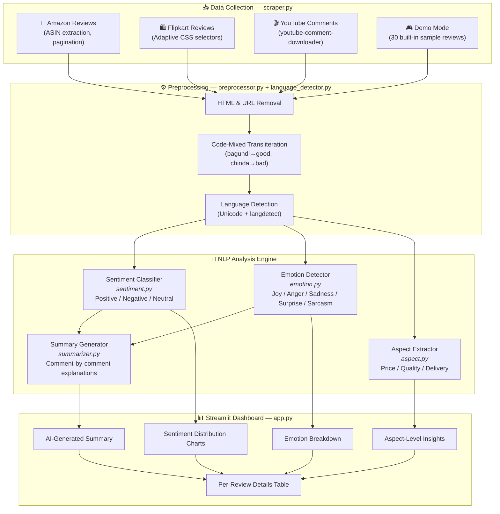
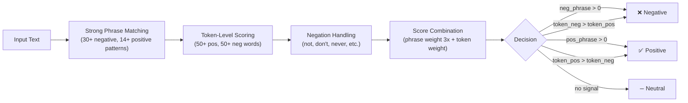
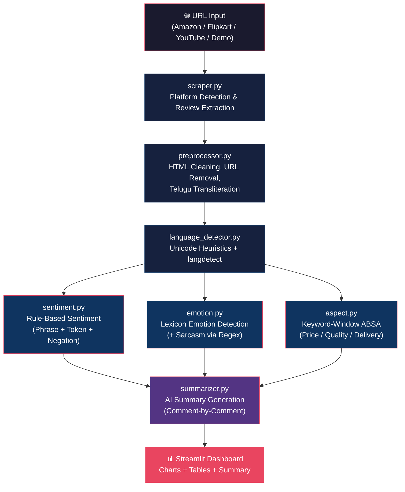

<div align="center">

# 🧠 Multi-Lingual Review Sentiment & Emotion Analyzer

### *Advanced NLP System for Multilingual & Code-Mixed Review Analysis*

[](https://nlp-sentiment-analyzer-2026.streamlit.app)

🚀 **Live Demo:**  
👉 https://nlp-sentiment-analyzer-2026.streamlit.app

[](https://python.org)
[](https://streamlit.io)
[](https://huggingface.co)
[](LICENSE)
[]()

<br/>

🎓 **B.Tech AI & Data Science — Academic Year 2024–25**

An advanced NLP-based system that performs **sentiment analysis**, **emotion detection**, **sarcasm identification**, and **aspect-based insights** on reviews scraped from multiple platforms, with native support for **code-mixed languages (Telugu + English)**.

<br/>

[📖 Overview](#-project-overview) · [🚀 Quick Start](#-quick-start) · [✨ Features](#-key-features) · [🏗️ Architecture](#️-system-architecture) · [📂 Structure](#-project-structure) · [🤝 Contributing](#-contributing)

---

</div>

## 📖 Project Overview

This project scrapes user reviews from **Amazon**, **Flipkart**, and **YouTube**, processes multilingual and code-mixed text (Telugu–English), and generates:

| Capability | Description |
|:---|:---|
| 🎯 **Sentiment Classification** | Classifies each review as **Positive**, **Negative**, or **Neutral** using rule-based NLP with negation handling |
| 😊 **Emotion Detection** | Detects emotions — **Joy**, **Anger**, **Sadness**, **Surprise**, **Sarcasm**, **Neutral** — via lexicon matching |
| 🙄 **Sarcasm Detection** | Identifies sarcastic reviews using regex patterns and inversion detection (positive words + negative context) |
| 🔍 **Aspect-Based Insights** | Extracts per-aspect sentiment for **Price**, **Quality**, and **Delivery** using keyword-window analysis |
| 📝 **AI-Generated Summaries** | Produces detailed, comment-by-comment summaries with plain-English explanations |
| 🌐 **Language Detection** | Auto-detects English, Telugu, Hindi, Tamil, Kannada, Malayalam & code-mixed text via Unicode heuristics + `langdetect` |
| 📊 **Interactive Dashboard** | Real-time Streamlit dashboard with Plotly visualizations — sentiment distribution, emotion radar, aspect breakdowns |

---

## ✨ Key Features

<table>
  <tr>
    <td width="50%">
      <h3>🌐 Multilingual & Code-Mixed Support</h3>
      <ul>
        <li>Telugu + English code-mixed text processing</li>
        <li>Telugu word transliteration (<code>bagundi</code> → good, <code>chinda</code> → bad)</li>
        <li>Unicode-based script detection (Telugu, Hindi, Tamil, Kannada, Malayalam)</li>
        <li>Automatic code-mix identification (Latin + Indic scripts)</li>
      </ul>
    </td>
    <td width="50%">
      <h3>🤖 NLP Analysis Pipeline</h3>
      <ul>
        <li>Rule-based sentiment with strong phrase detection</li>
        <li>Negation-aware scoring (bi-directional window)</li>
        <li>Sarcasm detection via regex + inversion patterns</li>
        <li>Aspect-level keyword-window sentiment extraction</li>
      </ul>
    </td>
  </tr>
  <tr>
    <td width="50%">
      <h3>📡 Multi-Platform Scraping</h3>
      <ul>
        <li>Amazon product reviews (ASIN-based, multi-domain .in / .com)</li>
        <li>Flipkart customer reviews (adaptive CSS selectors)</li>
        <li>YouTube video comments (via <code>youtube-comment-downloader</code>)</li>
        <li>Built-in demo mode with 30 sample reviews</li>
      </ul>
    </td>
    <td width="50%">
      <h3>📈 Rich Visualizations</h3>
      <ul>
        <li>Sentiment distribution pie/bar charts (Plotly)</li>
        <li>Emotion breakdown visualizations</li>
        <li>Aspect-level (Price/Quality/Delivery) sentiment bars</li>
        <li>Summary stats: total reviews, positive %, negative %, neutral %</li>
      </ul>
    </td>
  </tr>
</table>

---

## 📂 Project Structure

```
NLP_sentiment_analyzer/
│
├── 📄 app.py                        # Streamlit application — main entry point
├── 📄 requirements.txt              # Python dependencies
├── 📄 test_scraper.py               # CLI tool to test scraping from any URL
├── 📄 README.md                     # Project documentation (this file)
├── 📄 .gitignore                    # Git ignore rules
│
└── 📁 modules/                      # Core NLP & scraping modules
    ├── scraper.py                   # Multi-platform review scraper (Amazon, Flipkart, YouTube)
    ├── preprocessor.py              # Text cleaning, HTML removal, code-mixed handling
    ├── language_detector.py         # Language detection (Unicode heuristics + langdetect)
    ├── sentiment.py                 # Sentiment analysis (rule-based with negation & phrase detection)
    ├── emotion.py                   # Emotion detection (Joy, Anger, Sadness, Surprise, Sarcasm)
    ├── aspect.py                    # Aspect-Based Sentiment Analysis (Price, Quality, Delivery)
    └── summarizer.py                # AI summary generation with comment-by-comment explanations
```

---

## 🏗️ System Architecture



---

## 🚀 Quick Start

### Prerequisites

- **Python** 3.9 or higher
- **pip** (Python package manager)
- **Git**

### 1️⃣ Clone the Repository

```bash
git clone https://github.com/NanubalaSravani/NLP_sentiment_analyzer.git
cd NLP_sentiment_analyzer
```

### 2️⃣ Create a Virtual Environment

```bash
# Windows
python -m venv venv
venv\Scripts\activate

# macOS / Linux
python3 -m venv venv
source venv/bin/activate
```

### 3️⃣ Install Dependencies

```bash
pip install -r requirements.txt
```

> **⚠️ PyTorch Note:** If you face issues installing PyTorch, follow the [official guide](https://pytorch.org/get-started/locally/) to install the correct version for your system.

### 4️⃣ Run the Application Locally

```bash
streamlit run app.py
```

### 5️⃣ Test the Scraper (Optional)

```bash
# Test with a real URL
python app.py "https://www.amazon.in/dp/B0EXAMPLE"

# Test with demo data
python app.py "demo"
```

---
## 🌐 Live Demo

👉 Replace with:

```markdown
```bash
# Try the application here:  
https://nlp-sentiment-analyzer-2026.streamlit.app
> ⚠️ Note: App may take a few seconds to load (free hosting).
```


## 🧰 Tech Stack

| Layer | Technology | Purpose |
|:---|:---|:---|
| **Frontend** | Streamlit, Plotly | Interactive dashboard & visualizations |
| **NLP / ML** | HuggingFace Transformers, SentencePiece | Tokenization & model infrastructure |
| **Deep Learning** | PyTorch | Neural network backend |
| **Language Detection** | langdetect, Unicode heuristics | Identifies 10+ languages + code-mixed text |
| **Web Scraping** | BeautifulSoup, Requests, Selenium | Amazon & Flipkart review extraction |
| **YouTube** | youtube-comment-downloader | YouTube comment scraping |
| **Data Processing** | Pandas, NumPy | Data manipulation & analysis |
| **Parsing** | lxml | High-performance HTML parsing |

---

## 🔧 Module Details

### Module 1: `scraper.py` — Multi-Platform Review Extraction

| Platform | Method | Features |
|:---|:---|:---|
| **Amazon** | HTTP + BeautifulSoup | ASIN extraction, .in/.com domain fallback, pagination, anti-bot headers, retry logic |
| **Flipkart** | HTTP + BeautifulSoup | Adaptive CSS selectors (handles frequent UI changes), multi-page scraping |
| **YouTube** | youtube-comment-downloader | Video ID extraction, sorted by recent, no API key required |
| **Demo** | Built-in | 30 pre-loaded reviews including Telugu code-mixed text for instant testing |

### Module 2: `preprocessor.py` — Text Cleaning & Code-Mixed Handling

```
Raw Text → HTML Unescape → Remove Tags → Remove URLs → Normalize Whitespace → Telugu Transliteration → Clean Output
```

**Telugu Code-Mixed Transliterations:**

| Telugu Word | English Translation |
|:---:|:---:|
| `bagundi` | good |
| `chala` | very |
| `naku` | to me |
| `chinda` | bad |
| `ledu` | not |
| `kaadu` | not |

### Module 3: `language_detector.py` — Language Detection

- **Unicode heuristics** — Detects Telugu (U+0C00–U+0C7F), Hindi, Tamil, Kannada, Malayalam scripts
- **Code-mix detection** — Identifies text containing both Latin + Indic characters
- **langdetect fallback** — ISO 639-1 language detection for 15+ languages
- **Output examples:** `English`, `Telugu`, `Telugu+English (Code-Mixed)`, `Hindi`

### Module 4: `sentiment.py` — Sentiment Classification

Uses a **multi-layer rule-based approach**:



**Key Design Decisions:**
- Negative words are weighted **2x** higher than positive (negative reviews are harder to detect)
- Strong phrases override individual word scores (**3x multiplier**)
- Negation flips the meaning and persists for **2 tokens** ahead
- Includes Telugu negative words: `chinda`, `ledu`, `kaadu`

### Module 5: `emotion.py` — Emotion Detection + Sarcasm

| Emotion | Detection Method | Example Words |
|:---|:---|:---|
| 😊 **Joy** | Lexicon matching (26 joy words) | happy, love, amazing, bagundi, wow |
| 😠 **Anger** | Lexicon matching (24 anger words) | angry, hate, terrible, fraud, scam |
| 😢 **Sadness** | Lexicon matching (24 sadness words) | sad, disappointed, broken, regret |
| 😲 **Surprise** | Lexicon matching (16 surprise words) | wow, shocked, unexpected, omg |
| 🙄 **Sarcasm** | Regex patterns + inversion detection | "oh great", "yeah right", positive+negative word mix |
| 😐 **Neutral** | Fallback (no emotion words detected) | — |

**Sarcasm Detection Algorithm:**
1. Match against 4 regex patterns (e.g., `oh sure`, `yeah right`, `great job...not`)
2. Check for **word inversion** — positive words (great, amazing) co-occurring with negation words (but, not, however)

### Module 6: `aspect.py` — Aspect-Based Sentiment Analysis

Extracts per-aspect sentiment for three product dimensions:

| Aspect | Keywords (subset) | Window Size |
|:---|:---|:---:|
| 💰 **Price** | price, cost, expensive, cheap, afford, value, worth, money, overpriced, deal | ±6 tokens |
| ⭐ **Quality** | quality, build, material, durable, flimsy, premium, defective, genuine, design | ±6 tokens |
| 🚚 **Delivery** | delivery, shipping, arrived, delay, fast, quick, package, tracking, dispatched | ±6 tokens |

**Algorithm:** For each aspect keyword found in a review, a **±6 token window** is analyzed for positive/negative words with negation handling. Results are aggregated across all reviews.

### Module 7: `summarizer.py` — AI Summary Generation

Generates a comprehensive markdown report with:

1. **📊 Overall Analysis** — Total reviews, verdict (overwhelmingly positive / mixed to negative / etc.)
2. **😊 Sentiment Insights** — Detailed positive vs negative breakdown
3. **💬 Emotion Insights** — Dominant emotion and per-emotion counts
4. **🙄 Sarcasm Detection** — Percentage and interpretation of sarcastic reviews
5. **🎯 Analysis Reliability** — Average confidence score, high/low confidence counts
6. **💡 Key Takeaway** — Actionable summary based on the data
7. **🔍 Comment-by-Comment Meaning** — Plain English explanation for every single review

---

## 📋 Usage Guide

### Option 1: Analyze Reviews from a URL

1. Open the Streamlit app (`streamlit run app.py`)
2. Select the platform — **Amazon**, **Flipkart**, or **YouTube**
3. Paste the product or video URL
4. Set the number of reviews to analyze
5. Click **"Analyze Reviews"**
6. Explore sentiment charts, emotion breakdown, aspect insights, and the AI summary

### Option 2: Demo Mode

1. Type `demo` as the URL — the app will load **30 built-in sample reviews**
2. Includes English, Telugu, and code-mixed reviews for comprehensive testing

### Option 3: Test Scraper via CLI

```bash
# Amazon product
python test_scraper.py "https://www.amazon.in/dp/B0CX23V2ZK" 

# Flipkart product
python test_scraper.py "https://www.flipkart.com/product-name/p/itm123"

# YouTube video
python test_scraper.py "https://www.youtube.com/watch?v=dQw4w9WgXcQ"

# Demo data
python test_scraper.py "demo"
```

### Sample Code-Mixed Reviews (Telugu + English)

```
"chala bagundi! delivery kuda fast ga vachindi. price kuda reasonable ga undi."
→ Detected: Telugu+English (Code-Mixed) | Sentiment: Positive | Emotion: Joy

"idi chinda product. paise waste chesanu. never buying again."
→ Detected: English (with Telugu words) | Sentiment: Negative | Emotion: Anger

"Oh great, the package arrived damaged. So helpful indeed. NOT."
→ Detected: English | Sentiment: Negative | Emotion: Sarcasm
```

---

## 📦 Dependencies

```txt
# Core NLP & ML
transformers>=4.38.0
torch>=2.0.0
sentencepiece>=0.1.99          # Required by XLM-RoBERTa tokenizer

# Data Processing
pandas>=2.0.0
numpy>=1.24.0

# Web Scraping
requests>=2.31.0
beautifulsoup4>=4.12.0
selenium>=4.15.0               # For JS-rendered pages (optional)
youtube-comment-downloader>=0.1.68

# Language Detection
langdetect>=1.0.9

# Frontend & Visualization
streamlit>=1.32.0
plotly>=5.18.0

# Utilities
lxml>=4.9.0                    # Faster HTML parser for BeautifulSoup
```

---

## 🔬 Methodology



### Processing Pipeline Steps

| Step | Module | Description |
|:---:|:---|:---|
| 1 | `scraper.py` | Detect platform from URL → Scrape reviews with pagination & anti-bot measures |
| 2 | `preprocessor.py` | Unescape HTML → Strip tags & URLs → Normalize whitespace → Transliterate Telugu words |
| 3 | `language_detector.py` | Check Unicode ranges → Detect code-mixing → Fallback to `langdetect` |
| 4 | `sentiment.py` | Match strong phrases → Token-level scoring with negation → Weighted combination → Label |
| 5 | `emotion.py` | Check sarcasm patterns → Lexicon emotion matching → Assign dominant emotion |
| 6 | `aspect.py` | Find aspect keywords → Score ±6 token window → Aggregate across reviews |
| 7 | `summarizer.py` | Compute statistics → Generate verdict → Explain each comment → Format markdown report |

---

## 🧪 Testing

### Test the Scraper

```bash
# Quick scraper test
python test_scraper.py "demo"
```

**Expected Output:**
```
Testing URL: demo
Platform: Demo
Extracted 10 reviews.
{'text': 'Absolutely love this product! The quality is outstanding...', 'rating': 5, 'timestamp': '2024-01-01'}
```

### Verify Individual Modules

```python
# Test sentiment analysis
from modules.sentiment import analyze_sentiment
results = analyze_sentiment(["This product is amazing!", "Terrible quality, waste of money"])
print(results)
# [{'label': 'Positive', 'score': 0.95}, {'label': 'Negative', 'score': 0.9}]

# Test emotion detection
from modules.emotion import detect_emotions
results = detect_emotions(["Oh great, another broken product. So helpful. NOT."])
print(results)
# [{'label': 'Sarcasm', 'score': 0.8}]

# Test language detection
from modules.language_detector import detect_language
print(detect_language("chala bagundi product"))  # "English"
print(detect_language("ఈ ఉత్పత్తి చాలా బాగుంది"))  # "Telugu"
print(detect_language("ఈ product chala bagundi"))  # "Telugu+English (Code-Mixed)"
```

---

## 🛣️ Roadmap

- [x] Multi-platform review scraping (Amazon, Flipkart, YouTube)
- [x] Rule-based sentiment analysis with negation handling
- [x] Emotion detection with sarcasm identification
- [x] Aspect-based sentiment analysis (Price, Quality, Delivery)
- [x] Telugu + English code-mixed language support
- [x] Language detection for 10+ languages
- [x] Interactive Streamlit dashboard with Plotly charts
- [x] AI-generated comment-by-comment summaries
- [x] Anti-bot measures for scraping (rotating headers, delay, retries)
- [x] Demo mode with 30 built-in sample reviews
- [ ] Transformer-based sentiment model (XLM-RoBERTa fine-tuning)
- [ ] Support for additional Indian languages (Hindi, Tamil, Kannada)
- [ ] CSV file upload for custom review analysis
- [ ] Real-time review streaming & live dashboard updates
- [ ] REST API for external integrations
- [ ] Docker containerized deployment
- [ ] Comparative analysis across platforms
- [ ] Export results as PDF/CSV reports

---

## 🤝 Contributing

Contributions are welcome! Please follow these steps:

1. **Fork** the repository
2. **Create** a feature branch (`git checkout -b feature/amazing-feature`)
3. **Commit** your changes (`git commit -m 'Add amazing feature'`)
4. **Push** to the branch (`git push origin feature/amazing-feature`)
5. **Open** a Pull Request

Please ensure your code follows the project's coding standards and includes appropriate tests.

---

## 👥 Team

| Name | Role | Contact |
|:---|:---|:---|
| **Nanubala Sravani** |  NLP & Data Engineer | [](https://github.com/NanubalaSravani) |
| *Team Member 2* | ML Engineer | [](https://linkedin.com/) |
| *Team Member 3* | Frontend & Visualization | [](https://linkedin.com/) |
| *Team Member 4* | Data Collection & Testing | [](https://linkedin.com/) |

### Faculty Guide

- **Prof. _Guide Name_** — Department of AI & Data Science

---

## 📜 License

This project is licensed under the **MIT License** — see the [LICENSE](LICENSE) file for details.

---

## 📚 References

1. Devlin, J., et al. (2019). *BERT: Pre-training of Deep Bidirectional Transformers for Language Understanding*. NAACL-HLT.
2. Conneau, A., et al. (2020). *Unsupervised Cross-lingual Representation Learning at Scale (XLM-RoBERTa)*. ACL.
3. Pontiki, M., et al. (2016). *SemEval-2016 Task 5: Aspect-Based Sentiment Analysis*. SemEval.
4. Khanuja, S., et al. (2020). *GLUECoS: An Evaluation Benchmark for Code-Switched NLP*. ACL.
5. Prabhu, A., et al. (2020). *Sentiment Analysis for Dravidian Languages in Code-Mixed Text*. DravidianLangTech.
6. Narang, S. & Raffel, C. (2021). *Do Transformer Modifications Transfer Across Implementations and Applications?* EMNLP.

---

## 🌟 Acknowledgements

- [HuggingFace](https://huggingface.co/) for Transformer model infrastructure
- [Streamlit](https://streamlit.io/) for the interactive dashboard framework
- [Plotly](https://plotly.com/) for rich interactive visualizations
- [youtube-comment-downloader](https://github.com/egbertbouman/youtube-comment-downloader) for YouTube comment extraction
- [langdetect](https://github.com/Mimino666/langdetect) for language detection
- Our institution's **Department of AI & Data Science** for guidance and support

---

<div align="center">

**⭐ If you found this project helpful, please consider giving it a star! ⭐**

<br/>

Made with ❤️ for the B.Tech AI & DS Final Year Project

<br/>

[](https://github.com/NanubalaSravani/NLP_sentiment_analyzer)
[](https://github.com/NanubalaSravani/NLP_sentiment_analyzer)

</div>
